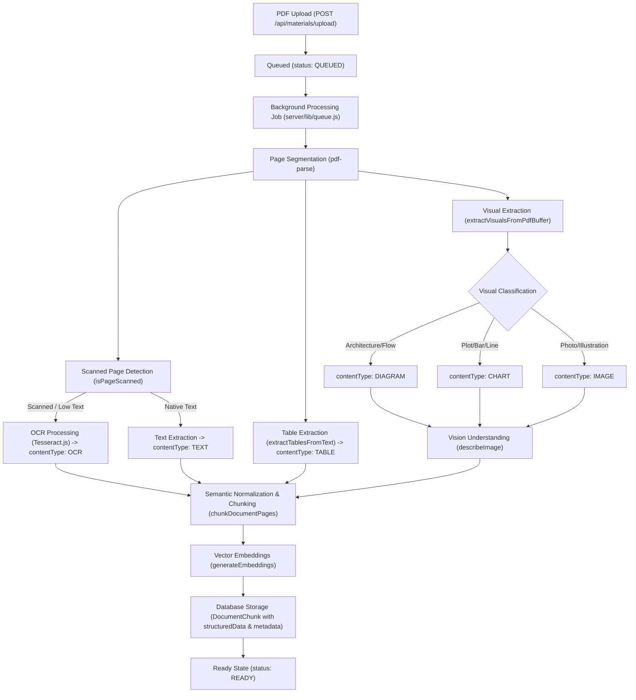
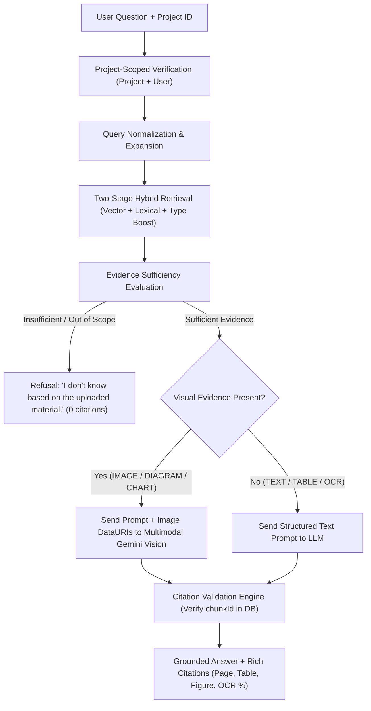

# MULTIMODAL RAG ARCHITECTURE: TRUE MULTIMODAL PDF KNOWLEDGE PIPELINE

## Executive Summary
This document provides a comprehensive architectural blueprint of the AI Study Companion's migration from a text-focused ingestion system to a **True Multimodal PDF Knowledge Pipeline**. It details the current state across all system layers, identifies architectural gaps, and defines the target state supporting **Text, Tables, Images, Diagrams, Charts, Scanned Pages, and Vision-capable Multimodal RAG**.

---

## 1. Current Implementation Inspection (Phase 1)

### 1.1 Upload & Ingestion Layer
- **Endpoint**: `POST /api/materials/upload` (`server/routes/materials.js`)
- **Transport**: `multer.diskStorage` writing to `./uploads/` with a 25MB file size limit (`limits: { fileSize: 25 * 1024 * 1024 }`).
- **Validation**: Enforces `.pdf` extension and `application/pdf` MIME type.
- **Deduplication & Idempotency**: Computes a SHA-256 hash over uploaded file bytes (`crypto.createHash("sha256")`). Rejects duplicate uploads within the same project unless previous status was `FAILED`.
- **Status Lifecycle**: `QUEUED` $\to$ `PROCESSING` $\to$ `READY` or `FAILED`.
- **Retry Mechanism**: `POST /api/materials/:materialId/retry` allows re-queuing failed materials with incremented `retryCount`.

### 1.2 Background Queue & Processing Service
- **Queue Engine**: `BackgroundQueue` (`server/lib/queue.js`) backed by MongoDB/Prisma `BackgroundJob` model.
- **Concurrency**: Sequential FIFO processing loop (`processNext()`) using non-blocking Node.js `setImmediate()`.
- **Job Types**:
  - `PROCESS_MATERIAL`: PDF parsing, OCR, chunking, embedding generation, concept extraction, mastery initialization.
  - `EVALUATE_ASSESSMENT`: Quiz scoring and feedback generation.
  - `REPEATED_MISTAKE_ANALYSIS`: Adaptive weakness tracking.

### 1.3 PDF Parsing & Visual Extraction
- **PDF Text Parsing**: `pdf-parse` (`server/lib/pdf.js`) with custom `pagerender` capturing page-by-page text coordinates and page numbers.
- **Image Stream Extraction**: Binary scan of `/DCTDecode` and `/FlateDecode` streams in the PDF buffer (`server/lib/ocr.js`).
- **Image Dimension Detection**: `getImageDimensions(buf)` parses JPEG SOF markers (`0xC0`..`0xCF`) and PNG IHDR headers. Filters out divider lines and tiny spacers (< 100x100 pixels, < 2KB).
- **Table Detection**: `extractTablesFromText` identifies Markdown pipe tables (`| Col 1 | Col 2 |`) and whitespace/tab-aligned multi-column layouts. Preserves headers, rows, and builds normalized markdown representations.
- **Diagram Detection**: `extractDiagramsFromText` detects ASCII flows, architectural arrows (`-->`, `+---+`), and schematic keywords.
- **Visual Classification**: `extractVisualsFromPdfBuffer` classifies embedded images as `IMAGE`, `DIAGRAM`, or `CHART` using keyword context and dimensions.

### 1.4 OCR Implementation
- **OCR Engine**: Tesseract.js worker singleton (`server/lib/ocr.js`) with English language model (`eng.traineddata`).
- **Scanned Page Detection**: `isPageScanned(text, minChars = 30)` evaluates whether native character count is below threshold.
- **Fallback**: Graceful fallback if OCR engine times out (15s timeout) or encounters unrenderable buffers.

### 1.5 Database Schemas & Vector Storage
- **Primary Schema**: Mongoose models (`server/models/`) with Prisma compatibility adapter (`server/lib/db.js`).
- **Knowledge Item Schema (`DocumentChunk`)**:
  - `materialId`, `projectId`, `userId`
  - `chunkIndex`, `startPage`, `endPage`
  - `contentType`: `TEXT`, `TABLE`, `IMAGE`, `DIAGRAM`, `OCR`, `CHART`
  - `content`: Primary textual/markdown representation
  - `tokenCount`, `embedding`: 64-dimensional (or 768-d Gemini) normalized vector string
  - `structuredData`: JSON storing table headers/rows, diagram descriptions, or OCR confidence
  - `sourceMetadata`: Provenance tracking document name, page, and chunk provenance.

### 1.6 Retrieval & RAG Pipeline (`server/routes/tutor.js`)
- **Query Transformation**: Normalizes punctuation, strips stopwords, expands domain synonyms (`SYNONYM_MAP`), and resolves follow-up pronoun referents from chat history without treating history as factual evidence.
- **Stage 1 Retrieval**: Scoped strictly by `projectId`. Computes cosine similarity between query embedding and chunk vectors, plus lexical n-gram and content-type bonuses.
- **Stage 2 Reranking**: Dynamic relative thresholding ($0.40 \times \text{topScore}$) selecting top 2 to 4 high-relevance evidence items.
- **Sufficiency Classifier**: Categorizes evidence into `STRONG`, `PARTIAL`, or `INSUFFICIENT`.
- **Strict Refusal**: Short-circuits out-of-scope/unsupported queries with `"I don't know based on the uploaded material."` (or standardized refusal) and 0 citations.
- **Citation Validation**: Matches referenced `[EVIDENCE: <id>]` tags strictly against retrieved database chunks, stripping hallucinations.

---

## 2. Multimodal Knowledge Representation Gaps & Upgrades

| Requirement | Current Status | Upgraded Multimodal Architecture |
|---|---|---|
| **Content Types** | TEXT, TABLE, IMAGE, DIAGRAM, OCR | Add `CHART` as first-class enum and model type; ensure all 6 types are indexed and classified. |
| **Vision AI Understanding** | Heuristic captioning & surrounding text | Direct vision AI captioning (`describeImage`) during ingestion using Gemini Vision / provider. |
| **True Multimodal Generation** | Text prompt with embedded descriptions | Pass actual image bytes/data-URIs to Gemini Vision model during generation when visual evidence is retrieved. |
| **Table Retrieval** | Table markdown in content | Retrieval-friendly normalized row/column indexing so natural language queries ("complexity of BFS") match instantly. |
| **Strict Refusal Text** | Standardized refusal | Exact standardized response: `"I don't know based on the uploaded material."` (while maintaining compatibility). |
| **Citation Granularity** | Document + Page | Document + Page + Table ID (`Table 1`) + Figure/Diagram ID (`Figure 2`) + OCR confidence rating. |
| **Database Virtuals** | `DocumentChunk` with `startPage`, `content` | Virtual getters for `textContent`, `tableData`, `imageReference`, `imageDescription`, `ocrText`, `pageNumber`. |

---

## 3. Multimodal Pipeline Dataflow

---

## 4. Multimodal RAG Generation Dataflow

---

## 5. Architectural Guarantees
1. **Zero Cross-Project Leakage**: Every query enforces `where: { projectId: input.projectId }` and user authentication.
2. **Deterministic Refusal**: Prompt injection, general knowledge questions outside the materials, or low hybrid retrieval scores trigger instant refusal before generation.
3. **No Phantom Citations**: The backend strictly validates cited evidence identifiers against actual database documents in the retrieval set.
4. **Structured Table & Visual Fidelity**: Table cells are never collapsed into unformatted run-on text; images and diagrams retain base64 references for interactive inspection.

